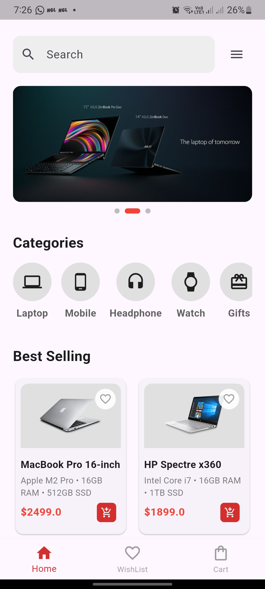
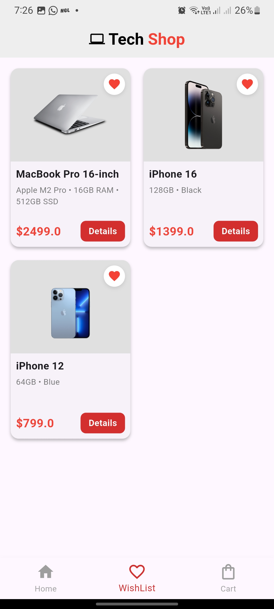
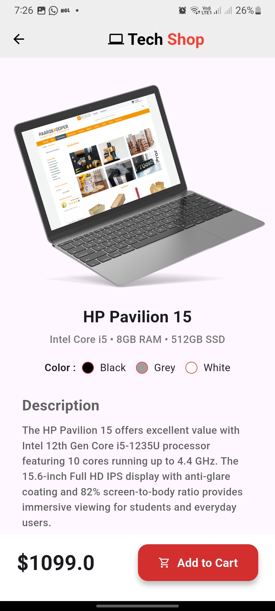
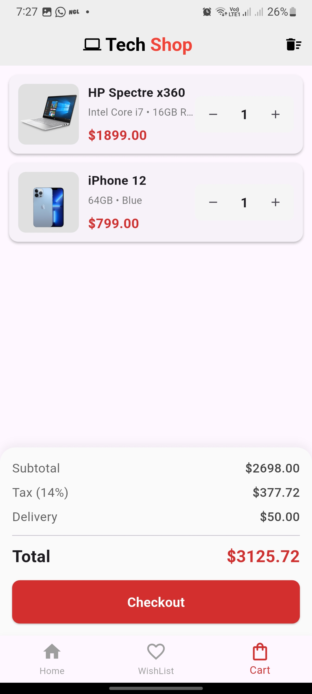

# 🛒 Tech Shop – E-Commerce Mobile Application

Tech Shop is a modern e-commerce mobile application focused on selling technology products such as laptops, smartphones, and accessories.  
The application provides a smooth and intuitive shopping experience with a clean UI and well-structured user flow.

This project simulates a real-world online tech store and demonstrates core e-commerce functionalities used in production-level mobile applications.

---

## 📱 Application Overview

Tech Shop allows users to:
- Browse tech products by category
- View best-selling items
- Check detailed product information
- Add products to cart or wishlist
- Review cart summary with automatic price calculation
- Proceed to checkout

The UI is designed to be minimal, modern, and user-friendly.

---

## ✨ Key Features

- Category-based product browsing  
- Best-selling products section  
- Product details page with description and color selection  
- Wishlist functionality  
- Shopping cart with quantity management  
- Automatic price calculation:
  - Subtotal
  - Tax
  - Delivery fee
  - Total amount
- Clean and consistent UI design

---

## 📸 Screenshots

All screenshots are located in the `assets/image` directory.

<table>
  <tr>
    <td align="center">
      <b>Home Screen</b> 
      
    </td>
    <td align="center">
      <b>Wishlist Screen</b> 
      
    </td>
  </tr>
  <tr>
    <td align="center">
      <b>Product Details</b> 
      
    </td>
    <td align="center">
      <b>Cart Screen</b> 
      
    </td>
  </tr>
</table>

---

## 🧮 Price Calculation Logic

- **Subtotal**: Sum of all selected product prices  
- **Tax**: 14% of subtotal  
- **Delivery Fee**: Fixed cost  
- **Total**: Subtotal + Tax + Delivery  

The total price updates dynamically based on cart changes.

